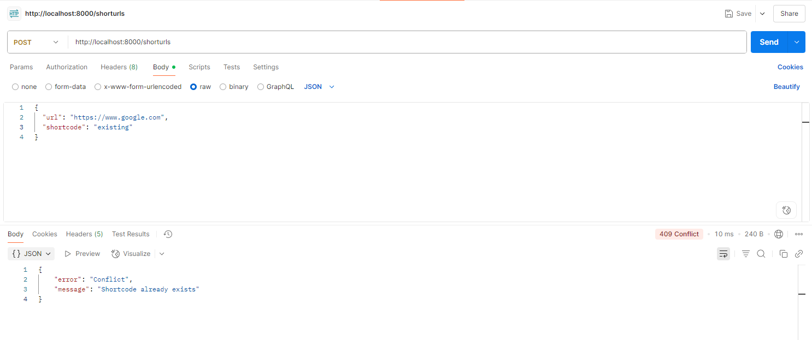

# URL Shortener Service

A lightweight and fast URL shortener built with FastAPI. 

## Features

- **Quick URL Shortening**: Generate short links instantly
- **Custom Shortcodes**: Use your own custom names for shortened URLs
- **Expiry Control**: Set how long your links should remain active
- **Click Analytics**: Track clicks with referrer information and location data
- **URL Validation**: Automatic validation to ensure proper URL format
- **Duplicate Prevention**: Prevents conflicts with existing shortcodes

## Getting Started

### Prerequisites

Make sure you have Python 3.7+ installed on your system.

### Installation

1. Clone this repository or download the source code
2. Navigate to the project directory
3. Install the required dependencies:

```bash
pip install -r requirements.txt
```

### Running the Service

Start the server with:

```bash
python main.py
```

The service will be available at `http://localhost:8000`

You can also run it using uvicorn directly:

```bash
uvicorn main:app --host 0.0.0.0 --port 8000
```

## API Documentation

### 1. Health Check

**GET** `/`

Simple health check endpoint to verify the service is running.

**Response:**
```json
{
    "status": "healthy",
    "service": "URL Shortener Microservice"
}
```

### 2. Create Short URL

**POST** `/shorturls`

Creates a new shortened URL with optional custom shortcode and expiry time.

**Request Body:**
```json
{
    "url": "https://example.com",
    "validity": 30,
    "shortcode": "mylink"
}
```

**Parameters:**
- `url` (required): The original URL to shorten
- `validity` (optional): Expiry time in minutes (default: 30)
- `shortcode` (optional): Custom shortcode (4-10 alphanumeric characters)

**Response:**
```json
{
    "shortLink": "http://localhost:8000/mylink",
    "expiry": "2024-01-15T10:30:00Z"
}
```

### 3. Get URL Statistics

**GET** `/shorturls/{shortcode}`

Retrieves detailed analytics for a specific shortened URL.

**Response:**
```json
{
    "clickCount": 5,
    "originalUrl": "https://example.com",
    "createdAt": "2024-01-15T10:00:00Z",
    "expiry": "2024-01-15T10:30:00Z",
    "clickDetails": [
        {
            "timestamp": "2024-01-15T10:05:00Z",
            "referrer": "https://google.com",
            "location": "US"
        }
    ]
}
```

### 4. Redirect to Original URL

**GET** `/{shortcode}`

Redirects to the original URL and tracks the click.

## Testing with Postman

Here are some example requests you can try with Postman:

### Basic URL Shortening


### Custom Shortcode


### Time Validity Setting


### Format Validation


### Duplicate Detection


## Error Handling

The service includes comprehensive error handling:

- **400 Bad Request**: Invalid URL format or shortcode requirements not met
- **404 Not Found**: Shortcode doesn't exist
- **409 Conflict**: Shortcode already exists
- **410 Gone**: Short link has expired

## Configuration

### Shortcode Requirements
- Must be alphanumeric only
- Length between 4-10 characters
- Case sensitive

### Validity Period
- Minimum: 1 minute
- Default: 30 minutes
- No maximum limit

## Project Structure

```
url-shortner/
├── main.py                 # Main application file
├── error_handlers.py       # Custom error handling
├── logging_middleware.py   # Request logging middleware
├── requirements.txt        # Python dependencies
└── images/                # Postman screenshots
```

## Dependencies

- **FastAPI**: Modern web framework for building APIs
- **Uvicorn**: ASGI server for running the application
- **Pydantic**: Data validation using Python type annotations
- **Validators**: URL validation library
- **Python-multipart**: For handling form data

## Notes

- URLs are stored in memory, so they'll be lost when the service restarts
- For production use, consider implementing persistent storage

## Some Testing Examples

### Creating a simple short URL:
```bash
curl -X POST "http://localhost:8000/shorturls" \
     -H "Content-Type: application/json" \
     -d '{"url": "https://github.com"}'
```

### Creating a custom short URL with 60-minute validity:
```bash
curl -X POST "http://localhost:8000/shorturls" \
     -H "Content-Type: application/json" \
     -d '{"url": "https://stackoverflow.com", "validity": 60, "shortcode": "stack"}'
```

### Getting URL statistics:
```bash
curl "http://localhost:8000/shorturls/stack"
```